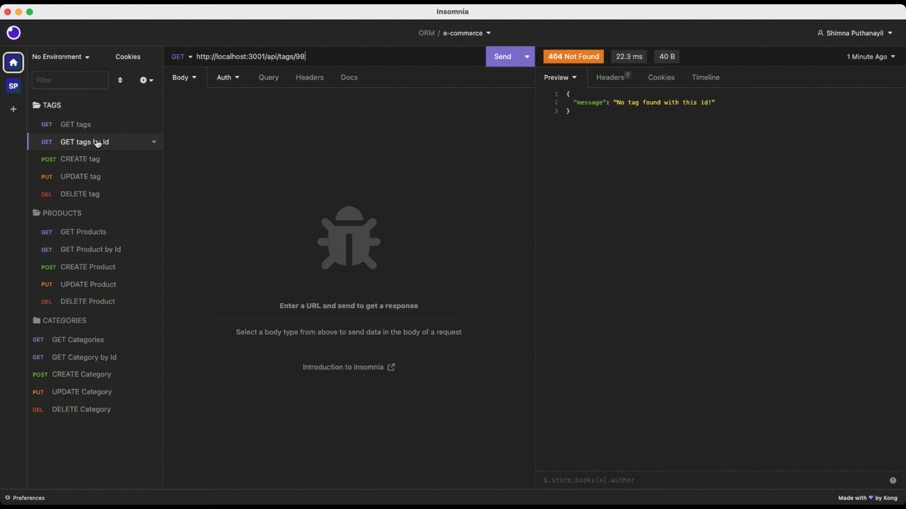
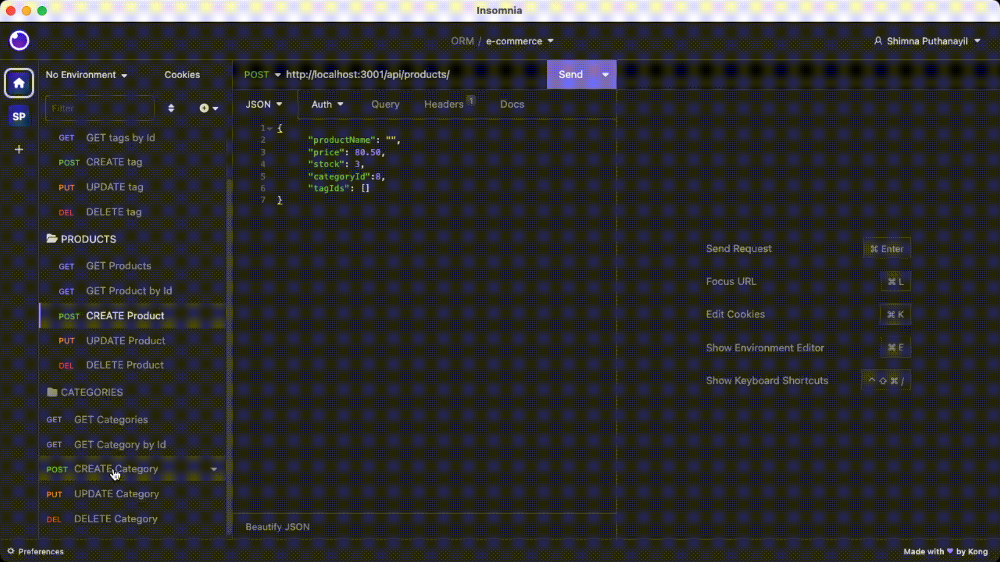
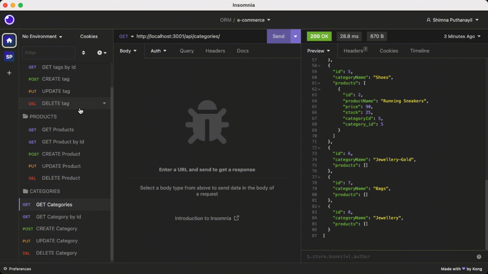
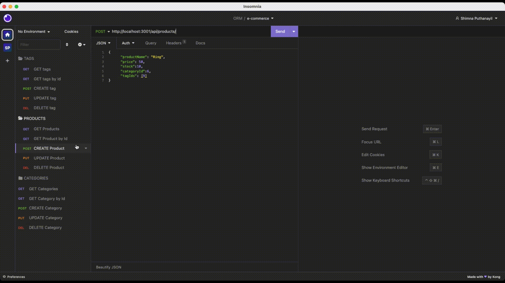

# E-commerce Back End

[](https://opensource.org/licenses/MIT)

## Description

This application builds a back end for an e-commerce website which helps the managers of the internet retails companies to compete with other e-commerce companies. A working Express.js API is configured to use Sequelize to interact with a MySQL database using the MySQL2 and Sequelize packages. The sensitive data like MYSQL username, password and database name are stored in environment variables using dotenv package and connected to the database using Sequelize. The database contains four models Category, Product, tag and ProductTag. Association methods are executed on Sequelize models to create the following relationships between them:

- **Product** belongs to one **Category**, as a category can have multiple products but a product can only belong to one category.

- **Category** has many **Product** models.

- **Product** belongs to many **Tag** models. 

- **Tag** belongs to many **Product** models.
- Using the **ProductTag** through model, products and tags are linked which allows products to have multiple tags and tags to have many products.

With the help of API Routes the RESTful CRUD operations are performed using these Sequelize models.

## Installation

- Install Node.js v16
- Install MySQL Server
- Clone the Repository from GitHub and navigate to the root directory
- Install necessary dependencies running the following command :

  ```
  npm i
  ```
- Create a .env file in the root directory and add the environment variables to hold your MySQL username, password and database name.

      DB_NAME='ecommerce_db'
      DB_USER='root'
      DB_PW='password'

- Login into MySQL by running the command

  ```
   mysql -u root -p
  ```

- Run the following command in the shell to create the database.

  ```
  source db/schema.sql
  ```

- Run the following command in the shell to seed the database.

  ```
  npm run seed
  ```

## Usage

The application can be invoked in the terminal by using the following command:

```
npm start
```

When the application is invoked using 'npm start' then the server will start listening on port 3001 and the routes can be tested in the Insomnia.

#### Link to walkthrough video :

https://drive.google.com/file/d/1duXGPenxdwkMXh-i9iAULnX-Pdb0PF6C/view?usp=sharing

The following images show the application's appearance and functionality :

**GET** route to return all the categories, tags and products being tested in Insomnia Core:


**GET** routes to return a single category, a single product, and a single tag being tested in Insomnia Core:



**POST**, **PUT**, and **DELETE** routes for categories being tested in Insomnia Core:



**POST**, **PUT**, and **DELETE** routes for tags being tested in Insomnia Core:



**POST**, **PUT**, and **DELETE** routes for products being tested in Insomnia Core:



## Credits

#### References

https://sequelize.org/docs/v6/core-concepts/validations-and-constraints/

https://sequelize.org/docs/v6/core-concepts/model-basics/#default-values

## License

[MIT](https://opensource.org/licenses/MIT) license.
